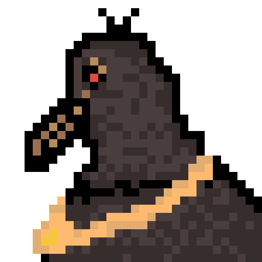

# 🙌 Welcome!

## Subjects

<table data-view="cards"><thead><tr><th></th><th></th><th></th><th data-hidden data-card-target data-type="content-ref"></th><th data-hidden data-card-cover data-type="files"></th></tr></thead><tbody><tr><td></td><td><strong>About LLM</strong></td><td></td><td><a href="README (1).md">README (1).md</a></td><td></td></tr><tr><td></td><td><strong>MATH</strong></td><td></td><td><a href="broken-reference/">broken-reference</a></td><td><a href=".gitbook/assets/image.png">image.png</a></td></tr><tr><td></td><td><strong>Knowledge Graph</strong></td><td></td><td><a href="broken-reference/">broken-reference</a></td><td></td></tr></tbody></table>

***

## Profile

<figure><figcaption><p>Portrait of me</p></figcaption></figure>

```
LLM, Knowlege Graph 공부중인 학생입니다. 공부한 내용을 올립니다. 
내용이 정확하지 않을 수 있습니다. 
```

