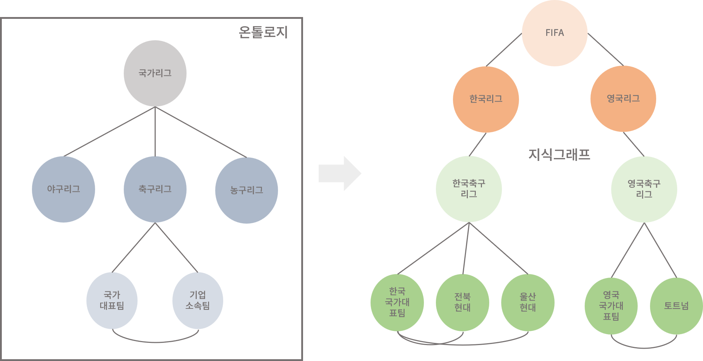

# Intro

## 사람과 기계의 "생각"

사람의 사고와 기계의 사고는 다르다. 기계가 사고를 할 줄 아느냐는 질문은 잠수함이 수영할 수 있느냐는 질문과 같다.

잠수함이 물속에서 나아가는 것은 사실상 사람이 수영하는 것과 같은 효과를 갖지만, 그것이 곧 '수영'이라는 행위와 동일하다고 보기엔 어렵다. 잠수함은 그저 생물체가 수영하는 행위를 기계적으로 구현한 것이기 때문이다.

즉, 겉보기에 둘의 행위는 유사하지만 본질적으로는 전혀 매커니즘을 갖고 있다. 사람과 기계의 사고도 마찬가지이다.

## 존 설의 중국어 방 (Chinese Room)

존 설이 제시한 중국어 방은 튜링테스트로는 인공지능 여부를 판정할 수 없다는 것을 논증하기 위한 사고실험이다. "기계가 실질적으로 사고가능한가?" 라는 것에 대한 증명을 다루고 있다.

실험에서 등장하는 '중국어 방'은 중국어 단어를 넣는 구멍과 중국어 단어에 대응하는 영어 단어를 내보내주는 구멍으로 구성되어 있다. 방 내부에는 중국어와 영어 뜻이 맵핑되어 있는 rule book이 있다. 그리고, 중국어에 대한 지식이 전무한 영어 사용자가 이 방안에 들어간다.

방 안의 사람은 방 밖에 있는 사람이 넣는 중국어 단어가 쓰인 공을 구멍으로 받고, rule book을 참조하여 중국어 단어에 대응하는 영어 단어 공을 찾아 영어 단어 공이 나가는 구멍 밖으로 전달한다. 방 바깥의 사람은 중국어 방에 있는 사람이 정말로 중국어를 할 수 있는 것 처럼 보이게 될 것이다. 

존 설은, 기계의 '사고'란 사실상 '중국어 방'과 다를 바 없다고 주장한다. 방 안의 사람이 아예 중국어와 영어에 대한 이해가 없는 것처럼, 컴퓨터도 이들 자체에 대한 이해 없이 그저 요소와 요소를 맵핑하는게 전부라는 것이다. 그러므로 단순히 기계가 질문답변을 할 수 있는지에 대한 여부로는 기계가 지능을 가졌는지 판정할 수 없다는 것이 그의 주장이다.

> 하지만, 이러한 존 설의 주장은 논리적인 한계가 있다. 사람 역시 처음 언어를 학습할 때 기호체계와 사물, 현상을 대응시키며 언어를 사용하기 때문이다. 따라서 그의 논리대로라면 사람조차도 언어를 제대로 이해하고 있는지가 불분명해진다. 따라서, 학자들은 중국어 방 안의 사람은 언어를 이해하지 못하지만, rule book이 있는 중국어 방의 총체는 언어를 이해한다고 본다.

## 사람같은 사고

그럼, 반대로 사람은 어떻게 사고할까? "apple" 이라는 영어 단어를 봤을 때, 우리는 무엇을 떠올리는가? 

"사과"라는 단어가 떠오를 것이고, 사과의 이미지, 또는 기업 애플이 떠오를 것이다. 

즉, 사람은 하나의 표현(symbol)에서 동시에 여러개의 표현들을 떠올린다. 

따라서, '중국어 방'에 만약 두 언어를 잘 이해하고 있는 사람이 들어가 있고 rule-book도 없다면, 방 안의 사람은 여러개의 공을 내보내게 될 수도 있을 것이고, 들어간 사람마다 제각각의 공이 나올 것이다.

존 설의 비유를 빌려 지식그래프를 설명하면, 지식그래프라는 것은 개념과 개념, 개념과 개념의 관계를 명세한 rule book과 같다.

---

## 온톨로지, 시멘틱 웹, 지식그래프

지식그래프를 설명할 때, 주로 함께 등장하는 단어는 온톨로지와 시멘틱 웹이다. 이 셋의 정의는 뭐고 관계는 어떻게 되는 것인가?

시멘틱 웹, 지식그래프를 논의하기 전에 먼저 다뤄야 할 단어는 온톨로지이다.

### 온톨로지

온톨로지란, 직역하면 "존재론"으로, 아리스토텔레스가 제시한 이론이다. 

아리스토텔레스는 언어가 사물과 개념, 개념과 개념을 엄밀히 정의하지 못한다고 보았다. 

따라서 아리스토텔레스는 언어의 차원에서 벗어나 현상과 개념을 정의하고, 개념과 개념의 관계에 따라 현실 세계의 존재를 정확히 설명하고자 하였다.

> 아리스토텔레스는 "물체를 보다"라는 표현을 예로 들었다. 실제로 물체를 보는 행위는 그저 눈에 반사된 빛의 상이 맺히는 현상이며, 따라서 능동적 행위가 아닌 수동적 행위에 가깝다. 즉, 언어적 표현이 실세계의 존재를 정확하게 묘사하지 않는다는 것이다.  이러한 사례를 들어 아리스토텔레스는 언어에 구애받지 않는, 관념 그 자체인 '이데아(Idea)'를 제시하였다. 온톨로지는 곧, 현상의 이데아들이 맺는 관계를 정의하는 이론인 것이다.

보다 쉽게 설명하자면, 개념을 정의하고, 개념과 다른 개념의 관계, 전체 개념들의 구조를 설명하는 것을 온톨로지라고 할 수 있다. 예를 들어, "말티즈 -(속하다)-> 개과 -(속하다)-> 포유강목" 과 같이 나타낼 수 있다. 

위 예시를 보면 개념-관계-개념으로 구성된 것을 확인할 수 있다. 이는 노드-엣지-노드로 구성된 그래프와 흡사하다. 실제로 온톨로지는 UML과 같은 그래프 구조의 표현 방식으로 표현된다.

### 지식그래프

지식그래프는 특정 분야의 지식을 해당 분야의 온톨로지에 따라 표현한 그래프를 의미한다. 예를 들어, 축구선수에 대한 온톨로지와 이를 따르는 지식 그래프가 있다고 하자. 축구 선수에 대한 온톨로지에서는 국가 리그가 축구 협회에 속하고, 축구 팀은 국가 리그에 속하고, 선수는 축구 팀에 속한다는 관계를 나타낸다. 지식 그래프는 온톨로지에서 제시된 관계에 따라 개별적인 선수, 팀, 리그가 갖는 관계를 표현한다. 

객체지향의 개념을 빌려 이해하자면, '클래스'끼리의 관계를 나타낸 것이 '온톨로지'이다. 클래스는 '국가', '축구협회', '국가 리그', '선수'처럼, 어떤 것을 묶어주는 '개념'인 것이고, '손흥민', '토트넘 훗스퍼', '영국'과 같은 실세계에 있는 개체를 '객체'라고 한다. 지식그래프는 이 '객체'들이 맺는 관계를 클래스의 관계에 따라 표현한 그래프를 의미한다.  

그림으로 보면 아래와 같다.

> 클래스와 객체에 대해 좀 더 자세히 설명하면, 클래스는 '붕어빵 틀'이고, 객체는 '붕어빵'이다. 어려운 말로는 개체의 공통적인 속성을 클래스라 하고, 실세계의 개체를 객체라고 설명하긴 하는데 잘 와닿는 설명은 아닌 것 같다. 아무튼 붕어빵 틀에서 구워져 나온 붕어빵이 다 똑같이 생긴 것처럼, 붕어빵, 즉 객체들은 자신이 속한 클래스의 속성을 공유한다.

### 시멘틱 웹

시맨틱 웹이란 웹에 존재하는 수많은 웹페이지들에 메타데이터(Metadata)를 부여하여, 웹페이지를 '의미'와 '관련성'을 가지는 거대한 데이터베이스로 구축하고자 하는 발상이다. 즉, 시멘틱 웹에서는 URL이 아닌, URI로 정보에 접근한다. 

그러니까, 예를 들어 '이순신'이라는 단어를 찾고자 할 때, 특정 포탈에 들어가서 검색을 하고, 특정 웹페이지에 들어가 정보를 열람하는 것이 아니라, 시멘틱 웹에 '이순신'에 대한 URI를 입력해 단일한 개념에 대한 검색 결과만을 리턴 받는 것이다.

이러한 URI는 단어 하나하나마다 모두 부여되어 있으며, 웹 페이지들은 URI를 중심으로 연결되게 된다. 

하지만, 시멘틱 웹은 실패했다고 평가된다. 실패 요인으로는 웹 페이지 생산자들이 통일된 메타데이터를 작성하는 것을 번거롭게 여겨 참여가 저조했다는 점이 컸다. 또한, 누구나 URI를 생성하고 수정할 수 있다는 점은 정보에 대한 오류 및 편향 위험성이 높일 위험이 있었다. 따라서 팀 버너스 리가 꿈꿨던, 웹 문서가 아닌 개념을 중심으로 구성되는 시멘틱 웹으로의 전환은 아직도 이뤄지지 않았다.

---

##  왜 그래프 데이터인가?

그렇다면, 이젠 좀 더 쉬운, 보다 실용적인 측면에서 그래프 데이터를 바라보자. 

그래프 데이터는 비단 LLM과 같은 인공 지능에게 적합한 데이터 모델인 뿐만 아니라, 실시간으로 변화하는 데이터의 모델링에도 적합하다.

예를 들어 한국 아이돌의 활동을 기록한 db가 있다고 해보자. 누군가 탈퇴하거나, 그룹명칭이 바뀌거나, 개인별 소속사가 바뀌는 등 수많은 변수가 존재할 것이다.

처음 DB에 기록할 때는 명확한 관계 규칙에 따라 기술하면 되므로 매우 편리하겠지만, 시간이 흘러 앞서 언급한 예상치 못한 사건들이 발생 했을 때, 이러한 변화들을 DB에 반영하기란 어려울 것이다.

즉, 기존의 관계형 데이터베이스는 처음에는 명확한 관계가 정의 되어 있으나 변화하는 속성이나 관계를 유연히 반영하기 어렵다는 단점이 있다.

반대로, 그래프 데이터베이스의 경우에는, 단순히 변경된 사안에 대해서 locally하고 유연하게 반영할 수 있다. 물론, 그래프 데이터베이스가 잘 동작하기 위해선 개념 모델을 잘 설계하는 과정이 필요하다.

