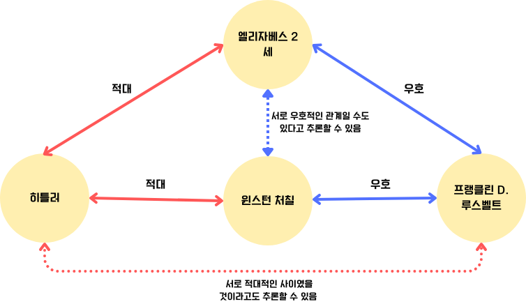

<head>
<!-- Google tag (gtag.js) -->

</head>

# [지식그래프] Knowledge Graph for Beginners 정리

---

**Materials** 

- Udemy 강의 : Knowledge Graph for Beginners : A concise introduction to knowledge graphs for complete beginners, (Tish Chungoora)

[Knowledge Graph for Beginners](https://www.udemy.com/course/knowledge-graph-for-beginners/)

---

### 지식과 그래프

<aside>
💡 지식그래프란?

**명시적으로 정의된 관계**로 연결된 **사실(facts)의 네트워크로**, 관계를 통해 **새로운 지식이 유추** 될 수 있다. 지식그래프는 ‘온톨로지’로 알려진 **기반 구조**나 스키마에 따라 구축된다.

</aside>

- **사실의 네트워크**
    - 지식그래프에서의 지식의 기본 단위는 사실과, 해당 사실과 관계된 사실, 그리고 두 사실 간의 관계로 표현된다.
    - 이러한 아이디어는 그래프 노드(정점)와 노드(정점)사이를 간선으로 표현하는 그래프 아이디어에서 비롯되었다.
        - 지식그래프와 언어모델
            
            지식그래프가 기존의 그래프 이론에서 발전한 만큼, 지식그래프도 node2vec, attention을 거쳐 발전한 언어 모델에 활용될 수 있으며, 릴레이션으로 단어 형태소 간의 자세한 관계 표현이 가능하다는 점에서 설명 가능한 언어모델을 만들 수 있을 것이라는 기대도 있었다.
            
    - 사실 네트워크(network of facts)의 기본단위는 ‘사실, 사실 관계에 있는 사실, 관계’(fact —relation—>fact)로 구성되며, ‘**triple(트리플)’**로 불린다.
    
- **명시적으로 정의된 관계(relation)**
    - 사실과 사실의 연결 짓는 요소로, 레이블을 가지며 대부분의 경우 방향성을 갖는다. 속성을 가질 수도 있다. 사람은 관계의 레이블을 바탕으로 사실과 사실간의 관계를 해석할 수 있다.
    - 클래스는 엔티티가 가질 수 있는 관계를 제한하여 무결성 제약 조건을 충족시킬 수 있다.
    
- **기반 구조**
    
    <aside>
    💡 real world object — Calssified by Taxanomy → Class A’s Entity 
    Class A’s Entity e —Relation *R* Defined by Ontology — Class B’s Entity e’
    
    </aside>
    
    - **클래스(Class)**
        
        강의 교안에서는 ‘Type of kind’ 로 정의하고 있다. 그대로 번역하면 ‘종류의 종류(…)’ 인데, 영어사전에서는 type과 kind를 약간 다르게 정의하고 있다.
        
        우선 kind는 ‘a type of thing or person’이고, type은 ‘group of people or things that have similar qualities’ 이다. 
        
        즉,  type은 ‘동질성을 갖는 객체들의 그룹’이며 kind는 특정 개체가 속한 동질성을 갖는 객체 그룹(type)을 의미한다.
        
        종합하여 해석하면 Class란, ‘어떤 집합에서, 동일한 속성을 공유한 객체들의 부분집합’이라고 할 수 있다. 동일한 concept을 갖는 객체 집합으로 생각하면 편하다. 
        
        클래스 내부의 개별 객체를 이르는 단어로는 보통 ‘entity’를 사용한다. 클래스 객체라고도 부른다.
        
    
    - **텍소노미(taxonomy ; 분류체계)**
        
        텍소노미에 대한 정의는 ‘클래스를 정렬하는 규칙’이다.  번역된 어휘는 ‘분류 체계’이다.  현실 세계의 객체를 특정한 클래스로 분류하는 체계라고 이해하면 쉽다. 
        
        텍소노미에서 발전한게 계통학인 것 같다..(확실하진 않다)
        
        십진분류를 생각하면 쉬운데, 분류체계는 일반적으로 계층구조를 가지며, 트리로 표현되기도 한다.
        
        - **(+) Folksonomy**
            
            대중에서 형성된 분류 체계를 의미한다. 즉, 컨텐츠의 주체가 생각하는 분류가 아닌 사용자 집단이 생각하는 분류이다. 대표적인 폭소노미 예시로 인스타그램 태깅을 들 수 있다. 인스타그램에서 게시물의 키워드를 나타내기도 하는 해시태그는 접근점으로 사용되며  사용자가 마음대로 생성할 수 있다. 
            
        
    - **온톨로지**
        
        존재하는 사물과 사물 간의 관계, 여러 개념을 컴퓨터가 처리할 수 있는 형태로 표현한 것.
        
        *온톨로지는 사물의 본질, 존재의 근본 원리를 사유나 직관에 의해 탐구하는 형이상학의 한 분야인 존재론을 기반으로 실재에 대한 정확한 이론을 추구하는 철학에서 유래되었다. 말 그대로, 온톨로지란 **현실세계의** **객체가 이루는 관계를 정합적으로 기술하는 도식(schema)이다.**
        
        온톨로지는 클래스가 가질 수 있는 관계의 종류, 그리고 관계가 갖는 속성에 대한 정의를 포함한다.
        
    - **텍소노미와 온톨로지**
        
        텍소노미는 클래스에 대한 분류 체계고, 온톨로지는 클래스에 따라 클래스 객체가 갖는 의미론적 연결 관계에 대한 규칙이다. 둘 다 어떤 체계에 대한 것이라 하니 서로 배타적인 관계에 있는 것 같기도 하지만 텍소노미와 온톨로지는 상호 유기적이다. 
        
        십진분류표로 이 책이 어떤 분류에 속하는지 정할 수 있지만, 이 책과 다른 책의 관계에 대해선 정의할 수 없다는 것을 생각하면 쉽다.
        
        - 예를 들어 십진분류체계에서  ‘순수과학’이라는 주제(클래스)는 ‘오직 자연현상 만을 다루며 공학적 활용이 일부 포함된 경우도 해당 주제에 분류함’이라는 분류 규칙이 있으며,
            
            십진분류체계를 준용하는 ‘문헌 온톨로지’라는 가상의 온톨로지에서 ‘ ‘순수과학’ 주제가 철학에 영향을 받았’다는 관계 규칙이 있다고 하자. 
            
            ‘철학’ 주제에는 A 도서가, ‘순수과학’ 주제에는 ‘B’도서가 분류되었다고 하자. ‘B’도서는 과학적 이론 설명과 함께 공학적 활용 분야도 함께 소개하고 있다.  ‘문헌 온톨로지’ 상에서는 A 도서가 B 도서에 영향을 주었다고 나타난다. 
            
            만약 십진분류체계가 수정되어 ‘순수과학’은 ‘오직 과학적 이론에 대한 내용만 다루며 공학적 활용에 대한 내용이 포함된 경우라도 ‘기술과학’으로 분류함.’ 으로 분류체계가 바뀐다면, A도서의 클래스는 바뀌며, 이에 따라 A도서와 B도서의 관계 역시 사라지게 된다.
            
        
        이렇듯, 텍소노미에 따라 개별 객체를 특정 클래스로 정의한다면, 온톨로지에서는 이를  바탕으로 클래스의 관계 규칙, 그리고 관계의 속성을 정의하게 되므로, 텍소노미에서의 체계를 수정한다면 이것이 온톨로지에도 영향을 미친다고 할 수 있다.
        
- **새로운 지식의 유추**
    
    
    
    객체들의 관계를 바탕으로 아직 정의되지 않은 관계를 유추하는 것을 의미한다. 쿼리를 통한 방법, 인공지능을 활용한 방법, 머신러닝을 활용하는 방법 등이 있다.
    
    - membership 자동 계산
    - Path Querying
    - Entity Resolution
    

