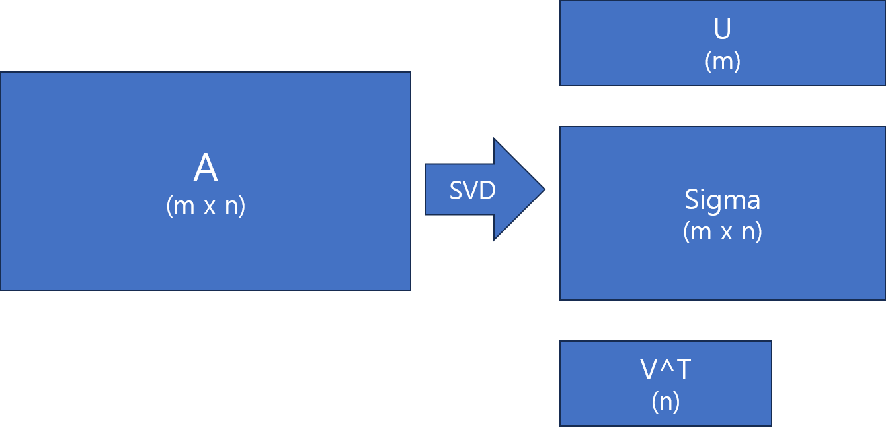

# 2. 특이값과 특이값 분해

## intro 

고유값분해는 실수인 고유값과 직교벡터인 고유벡터를 가지도록 **정사각행렬**을 분해한다. 고유값분해를 했을 때, 모든 행렬이 완벽하게 실수 고유값과 직교인 고유벡터를 갖는 것은 아니다. 즉, 고유벡터는 모든 형태의 행렬에 적용할 수 없다는 한계점을 갖는다.

반면, 특이값 분해는 모든 형태의 행렬에 적용할 수 있다는 장점이 있다.

> **특이값, 좌특이벡터, 우특이벡터**
>   선형대수에서 "특이(singular)"가 갖는 의미는 행렬식이 0인 정사각 행렬을 의미한다. 즉, 정방 행렬이나 역행렬이 존재하지 않는 행렬을 의미한다. 그리고 앞으로 다룰 특이값 분해에서 등장하는 좌특이벡터, 우특이벡터는 각각 원래 행렬 A의 열, 행을 선형독립인 기저벡터로 변환해주는 역할을 한다. 여기서 좌특이벡터는 U 행렬의 열벡터들을 의미하고, 우특이벡터는 V 행렬의 행벡터를 의미한다. 좌특이벡터와 우특이벡터는 직교하는 성질을 갖고 있다. 

데이터 사이언스에서 특이값 분해는 다방면에서 활용된다. 그 이유는 특이값분해는 어떠한 행렬이던 간에 행렬을 랭크 1인 조각으로 나눌 수 있으며, 나뉜 조각들이 중요한 순서대로 나온다는 특성을 갖기 때문이다.

조각 $$\sigma_1 u_1 v_1^T$$가 A에 가장 가까운 랭크 1 행렬이라고 할 수 있다.

---

## 특이값분해란?

특이값분해는 행렬을 좌특이벡터(left singular vector)와 우특이벡터(right singular vector), 고유값으로 분해하는 것이다. 좌특이벡터와 우특이벡터는 고유값 $$\sigma$$에 대응하는 기저라고 이해할 수 있다. 수식으로 보면 $$A = U\Sigma V^T$$ 이다. $$U$$는 좌특이벡터로 구성된 행렬이고, $$V$$는 우특이벡터로 구성된 행렬이다. 각 벡터 $$u_k, v_k$$는 직교하는 성질을 갖는다. (이 둘이 기저벡터임을 생각하면 자명하다.)

고유값 분해와 유사한 지점이 많으나, 특이값 분해는 $$A^TA$$ 와 $$AA^T$$가 무조건 대칭행렬이라는 점을 활용해, 행렬이 선형변환을 거쳐도 방향성을 잃지 않는 고유적인 특성 벡터를 구한다. 다만, 행렬이 정방행렬이 아니므로, 두 개의 특이벡터를 구하게 된다. 

$$A^TA$$와 $$AA^T$$가 대칭행렬임을 확인하는 식은 다음과 같다.

$$
(A^TA)^T = A^TA
\newline
(AA^T)^T = AA^T
$$

$$A^TA$$ 나 $$AA^T$$ 모두 전치해도 자기 자신과 같으므로 대칭적이라는 것이다.

---

## 특이값 분해 공식

기본적으로 특이값 분해는 $$A = U \Sigma V^T$$ 를 구하는 것이다.  이때, A에 A의 전치 행렬을 곱해 대각화 가능한 정방행렬로 만들어준다. 대각화가 가능하다는 것은 곧 분해가 가능한 형태라는 것이다.

$$A^TA$$ 와 $$AA^T$$는 다른 행렬이나, 공통적으로 둘 다 대칭적이다. 특이값 분해는 이 점을 활용해, 두 식으로부터 도출되는 특이벡터와 특이 벡터가 통과하는 시그마 행렬을 찾아낸다.

우선 $$A^TA$$로 특이값 분해하는 과정을 알아보자. 그 전에 특이값 분해가 가능하도록 하는 조건 3개를 알아보자.

> **특이값 분해의 조건**
1. $$V$$는 $$A$$의 정규직교 고유벡터를 포함한다.

2. $$U$$는 $$A$$의 정규직교 고유벡터를 포함한다.

3. $$\sigma_1. \sigma_2 ... \sigma_k$$는 $$A^TA, AA^T$$ 모두의 0이 아닌 고유값이다

특이값 분해는 $$A$$를 $$A^TA, AA^T$$의 대칭행렬을 좌특이벡터, 우특이벡터와 두 대칭행렬에서 공통적으로 갖는 고유값 행렬로 분해한다.

$$
AA^T = U\Sigma V^T \cdot V \Sigma^T U^T
\newline
V^T \perp V, \therefore V \cdot V^T = I
\newline
\therefore AA^T = U\Sigma\Sigma^T U^T
$$

U는 전치벡터와 직교하며 $$\Sigma\Sigma^T$$는 U 의 크기를 갖는 정방행렬이 된다. 

따라서, 사실상 $$Q\Lambda Q^T$$의 형태를 띄게 된다. 여기서부턴 고유분해하듯 구하면 된다.

다음으로는 $$A^TA$$로 특이값 분해하는 과정을 알아보자.

$$
A^TA = V\Sigma^TU^T \cdot U \Sigma V^T
\newline
U^T\cdot U = I, \therefore A^TA = V^T\Sigma^T\Sigma V
$$ 

$$AA^T$$의 식과 유사한 형태의 값이 나온다. 여기서도 V는 U와 마찬가지로 직교벡터이고, 시그마 행렬은 V의 크기를 따르는 정방행렬이다.
V도 U와 동일한 방식으로 구해준다.

- $$\Sigma \Sigma^T$$는 U의 차원수와 동일한 크기를 갖는 고유값의 정방행렬을 가진다.

- 반대로 $$\Sigma^T\Sigma$$는 $$V^T$$와 동일한 크기를 갖는 고유값의 정방행렬을 갖는다.

$$\Sigma$$는 $$V^T$$와 $$U$$가 공통적으로 통과하는 행렬로, $$\Sigma^T\Sigma, \Sigma\Sigma^T$$의 대각성분은 $$\sigma_n$$의 제곱으로 이뤄져 있다. $$dimension(U) > dimension(V^T)$$ 일 때, $$\Sigma\Sigma^T$$는 n개의 0이 아닌 U, V 모두의 고유값으로 이뤄진 대각성분을 가지며, m-n개의 나머지 대각성분은 0의 값을 갖는다. 

---

## 무어-펜로즈 유사역행렬(Moore-Penrose Pseudo Matrix Inverse)

무어-펜로즈 유사역행렬(:의사역행렬)은 임의 행렬에 A에 대해서 , m > n 이고 모든 열벡터가 선형 독립일 때 다음의 식이 성립한다.

$$
A^+ = (A^TA)^{-1}A^T
\newline
A^+A = (A^TA)^{-1}A^TA
\newline
A^+A = (A^TA)^{-1}(A^TA) = I
\newline
\therefore A^+A = I
$$

이때, $$A^TA$$는 가역행렬이다. 

$$A^+$$가 좌측 역행렬이 되는 것을 의미한다. 

반대로 n < m의 경우 $$A^+$$는 우측역행렬이 된다.

$$
A^+ = A^T(AA^T)^{-1}
\newline
AA^+ = AA^T(AA^T)^{-1}
\newline
AA^+ = (AA^T)(AA^T)^{-1} = I
\newline
\therefore AA^+ = I
$$

A의 의사역행렬을 구한는 방식은 특이값 분해를 거친다.

$$A = U\Sigma V^T$$로 분해되었을 때, $$A^+$$ 구해진 U, V를 바탕으로 다음의 공식을 통해 구해진다.

$$
A^+ = V\Sigma^+ U^T
$$

이때, $$\Sigma^+$$는 $$\Sigma$$는 특이값을 대각선상에 표현한 대각행렬이므로 유사역행렬은 단순히 특잇값들에 역수를 취하는 방식으로 구할 수 있다. 0인 값은 그냥 0으로 둔다.

---

## 선형회귀에서의 의사역행렬 활용

선형회귀라는 것은 기본적으로 독립변수($$x$$)에서 종속변수($$y$$)를 예측하기 위한 방법으로 독립변수와 가중치 벡터($$w$$)의 가중합으로 $$y$$와 가장 근사한 값 $$\hat{y}$$을 계산하는 것을 의미한다.

선형회귀모형을 수식적으로 재현하면 다음과 같다.

$$
\hat{y} = w^Tx
$$

예측의 정확성은 가중치벡터가 관건이라고 할 수 있다. 통상적인 관점에서의 머신러닝은 대체로 이 가중치를 정확하게 구하는 것이 목표이다.

가중치는 잔차제곱합(Residual Sum of Square : RSS)으로 구할 수 있다. 여기서 잔차라는 것은 예측값과 실제값의 차이, 즉 오차(error : $$e$$)를 의미한다. 목표는 간단하다. 잔차들의 합이 최소가 되도록 하는 것이다.

$$
\Sigma^N_{i=1} e^2 = \Sigma^N_{i=1}(y_i - w^Tx_i)^2  
$$

이 식을 좀 더 대수적관점에 접근해보면

$$
e^2 = e^Te
\newline
e^Te = (y-Xw)^T(y-Xw) 
$$

로 볼 수 있다.
---

## Ref