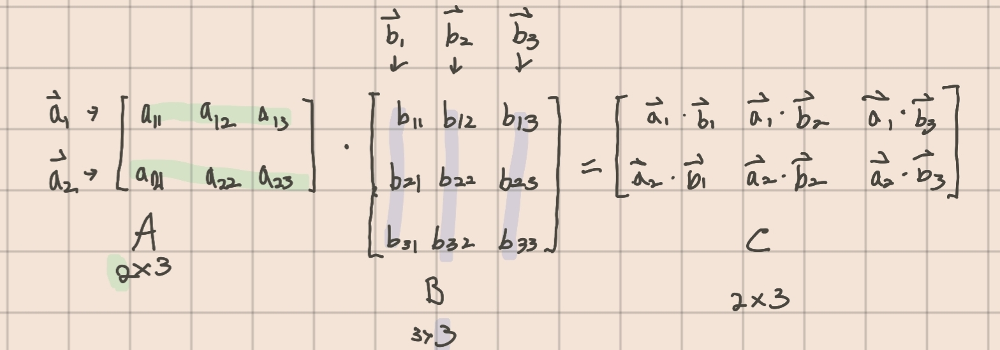

# 3. 텐서 연산

상태: 완료 키워드: 벡터, 선형대수, 코드, 텐서, 행렬

## 텐서 전치

스칼라, 벡터의 전치는 모두 텐서 전치의 일환이다. 전치를 기하학적으로 생각해보자면, 텐서의 크기를 유지시키면서 다른 차원으로 이동시키는 것이라고 할 수 있다.

### 스칼라 전치

스칼라의 전치는 자기 자신이다. 즉, 스칼라는 방향이 없으므로 전치해도 형상의 변화가 없다

### 벡터 전치

벡터 전치는 벡터의 행, 열값이 반대로 바뀌는 것이다. 쉽게 말해 행값, 열값이 반대로 바뀌는 것이다.

### 텐서 전치

텐서의 전치는 텐서의 행/열의 대각 행렬($$i=j$$)을 기준으로 값들이 반대로 바뀌는 것 을 의미한다.

$$
(AB)^T = B^TA^T
$$

***

## 텐서의 스칼라 연산

텐서에 스칼라를 더하거나 곱하는 연산은, 텐서의 형상을 유지시키며 텐서의 모든 값에 연산이 적용된다.

파이토치나 텐서플로우 모두 연산자 오버로딩을 통해, 마치 numeric한 값들을 연산하는 것처럼 기본 연산자(+,-..)를 사용해 계산할 수 있다.

***

## 아마다르곱

### 아마다르곱

아마다르곱은 형상이 동일한 두 벡터가 곱해지는 것을 의미한다. 아마다르곱은 동일한 인덱스값을 가진 원소들끼리 곱셈 연산을 진행하면 된다.

**아마다르곱과 행렬곱은 다른 개념이다. 엄밀히 따지면, 아마다르곱은 행렬 곱에서 파생된 것인데, 형상이 동일한 행렬에 대한 곱셈 연산을 일반화 한 것이 아마다르곱이다.**

아마다르곱은 일반적인 벡터의 곱($$\cdot$$)과는 다른 연산자( odot : $$\odot$$)를 사용한다.

$$
\mathbf{A} \odot \mathbf{B}
$$

파이토치, 텐서플로우 모두 일반적인 행렬곱 코드를 사용해서 계산한다.

***

## 행렬곱


행렬에 대한 곱셈은 벡터의 내적을 통해 이뤄진다. 행렬을 각각 행 벡터, 열 벡터로 쪼갠 후, 행,열 벡터에 대해 내적 한 값이 행렬곱이다. 결국엔 벡터에 대한 내적 연산이므로, 행 벡터로 쪼개지는 좌측 연산자의 열 개수와 열 벡터들로 쪼개지는 우측 연산자의 행 개수가 동일해야 한다.



$$m*n$$벡터와 $$n*k$$ 벡터의 곱셈연산의 결과 벡터는 $$m*k$$ 벡터이다.

일반적인 곱셈 연산과는 다르기에, 곱셈의 교환법칙은 성립하지 않으나 결합법칙, 분배법칙, 단위원 성질, 0의 곱셈성질은 동일하다.

<a name="section"></a>

### 행렬곱의 관점

1.  **내적**

    행렬곱을 두 행렬의 행, 열 벡터 각각의 내적으로 보는 관점이다. 행렬에서 각 요소들을 각각 행벡터, 열벡터로 보고, 이 행 벡터들과 열 벡터들의 각 내적을 구하는 방법으로, 일반적인 행렬곱 풀이에 적용되는 관점이다.

    

    기본적으로 벡터는 컬럼 기반이다. 위 그림에서 A, B는 행렬이 아니고 벡터들을 변수로 치환한 벡터이다. 그 과정에서, A는 전치 벡터들로 구성되었고, B는 일반 벡터(열벡터)로 구성되었다. 그리고 이 둘의 곱은, 전치 벡터와 일반 벡터의 내적으로 구해진다.
2.  **rank-1 matrix 합**

    rank란 어떤 행렬이 표현할 수 있는 차원을 의미한다. rank-1은 곧, 행렬이 1차원만을 표현할 수 있다는 것을 의미한다. 즉, 행렬의 모든 요소를 벡터 공간에 표현해도 일직선밖에 표현할 수 없다. rank-1행렬은 1차원 행벡터에 1차원 열벡터를 곱함으로써 얻을 수 있다.

    rank-1 matrics 합으로 행렬곱을 구하는 과정은, 행렬 요소를 각각 열벡터, 행벡터로 분해하여 곱셈 연산을 진행하고, 마지막에 연산 결과를 모두 더하는 과정으로 이뤄진다.

    A의 첫 번째 열벡터, B의 첫 번째 행벡터를 곱하면 행렬이 나온다. 이 계산 과정을 벡터 차원수만큼 반복해주고, 도출된 행렬들을 모두 더해주면 행렬곱 결과를 얻을 수 있다.

    $$
    \sum_{i=1}^n{a_n}{b_n^T}\newline a_{i\forall n}\in A, b_{i\forall n}^T\in B
    $$
3.  **column space 관점**

    

    

    선형연립방정식 및 선형회귀에서 차용하는 관점이다. 열벡터에 스칼라인 변수를 곱해 나오는 스팬 값으로 변수의 해를 찾는 방식이다.


1.  **row-space 관점**

    column-space 의 반대 관점이다. 이번에는 행 벡터에 변수를 곱해 나오는 행 스팬 값으로부터 변수의 해를 찾는 방식이다. 이때 현재 식에 전치 행렬을 적용하여, 변수 벡터를 행 벡터로 바꿔주고, 기존의 스칼라 열 벡터들도 행 벡터로 바꿔준다.

    주로 딥러닝 분야에서 취하는 관점이다. 행 벡터의 각 요소를 선형결합의 형태로 표현할 수 있기 때문이다. (리스트로 한번에 표현하여 쌓아버리는게 용이하기 때문)

    

***

## 벡터의 사영과 내적

### 벡터의 내적

A벡터와 B벡터의 내적 값은 곧 A 벡터와 B 벡터의 **닮은 정도**를 구하는 것이다. 여기서, 벡터는 방향값이라는 것이 존재하므로, A벡터의 B벡터에 대한 내적값과 B벡터의 A벡터에 대한 내적값은 전혀 다른 의미를 갖는다. 벡터 공간 상에서, A 벡터를 B 벡터 상에 표현했을 때의 크기와 B벡터를 A벡터 상에 표현하는 것은 완전히 다른 의미이기 때문이다. 이때 A를 B벡터 상에 나타내는 것을 **사영(projection)** 한다고 부른다.

벡터의 내적은 각 벡터의 크기와, 두 벡터의 사잇각의 곱으로 구할 수 있다.

$$
a \cdot b = ||b||cos\theta||a||
$$

### 벡터의 크기 구하기

$$
||A||\cdot \frac{B}{\sqrt{B^TB}}
$$

앞선 장에서 설명했듯이, 벡터의 크기는 벡터의 모든 요소의 제곱합에 제곱근을 취한 값이다.

$$
||A|| = \sqrt{\sum_{i \in A}a_i^2}
$$

또는, 다음과 같은 방식으로 나타낼 수도 있다.

$$
||A|| = \sqrt{A^TA}
$$

단위벡터를 구하는 방식을 위의 공식을 활용해 나타내면 다음과 같다.

$$
unitA =\frac{A}{||A||}= \frac{A}{\sqrt{A^TA}}
$$

### 정사영

정사영은 어떤 점을 평면 위로 내린 수선의 발을 의미한다. 벡터에서의 정사영이란, 벡터 a, b가 존재할 때, 벡터b의 종점을 벡터a에 수선의 발을 내리고, 그것을 종점으로 하는 벡터를 의미한다.

삼각함수를 이용하면, 정사영 벡터의 크기를 구할 수 있다.

$$
||proj_{a}b|| = ||b||cos\theta
$$

하지만 $$\theta$$를 알기 어려운 경우가 대부분이다. 사잇각을 모를 때, 벡터 b의 종점과 a에 내린 수선의 발 까지의 거리가 최소라는 점을 이용해 식을 유도하는 방법이 있다.

*   **정사영 공식 유도**

    

$$\theta$$값 없이 정사영을 구하는 공식은 다음과 같다.

$$
proj_ab = a(\frac{a\cdot b}{a \cdot a})
$$

### 정사영과 내적의 관계

벡터a의 단위벡터를 정사영 벡터의 크기를 구하는 식에 곱하면 정사영 벡터를 구할 수 있다.

$$
proj_ab = ||b||cos\theta\frac{a}{|a|}
$$

즉, 유도한 공식(사잇각 모를때 구하는 방법)과 equation 하면

$$
a(\frac{a\cdot b}{a \cdot a}) = ||b||cos\theta\frac{a}{||a||}
$$

이 식에서 a와 b의 내적을 유도할 수 있다.

$$
\frac{a\cdot b}{a \cdot a} = \frac{||b|| cos \theta}{||a||} \newline \newline a \cdot a = ||a||^2 \newline \newline \therefore \frac{a \cdot b}{||a||^2} = \frac{||b||cos\theta}{||a||}\newline \newline a \cdot b= ||b||cos\theta \frac{||a||^2}{||a||}\newline \newline \therefore a \cdot b = ||b||cos\theta||a||
$$

***

## python에서 내적 계산 방법

### numpy

```python
np.dot(X,Y)
```

### torch

```python
torch.dot(torch.tensor([]), torch.tensor([]))
```

### tensorflow

다른 라이브러리들과는 달리, 두 텐서를 곱한 다음 축소연산한다.

```python
tf.reduce_sum(tf.multiply(X,Y))
```

***

## Ref

[\[선대\] 2-5강. 행렬의 곱셈과 네 가지 관점 (열공간 (column space) 등)](https://www.youtube.com/watch?v=Lo8FsB1anzQ)

[행렬 곱에 대한 또 다른 시각 - 공돌이의 수학정리노트 (Angelo's Math Notes)](https://angeloyeo.github.io/2020/09/08/matrix\_multiplication.html)

[벡터의 내적, 정사영으로 깊이 생각하기(개념편)](https://m.blog.naver.com/ryumochyee-logarithm/221542210272)
