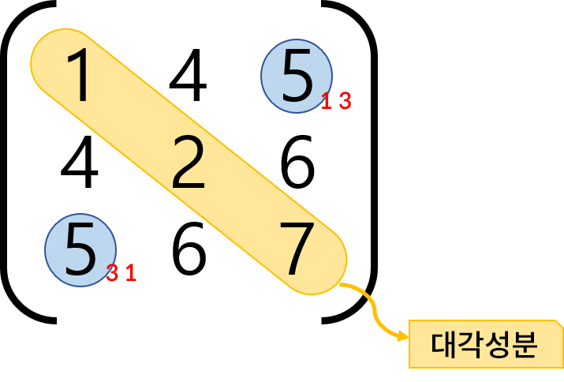
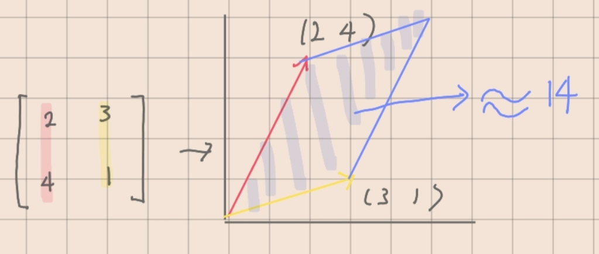
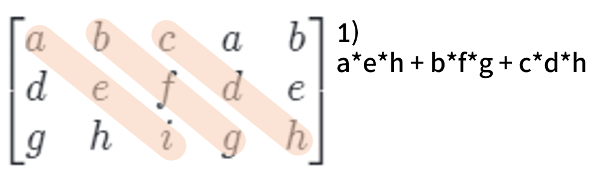
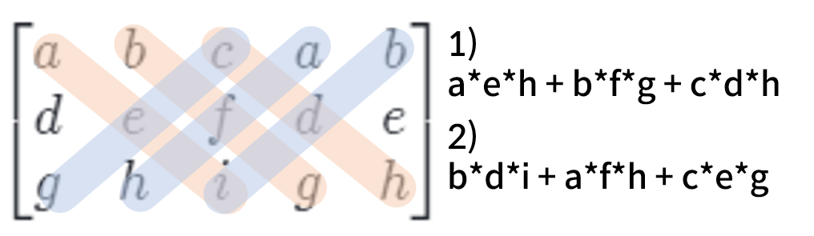
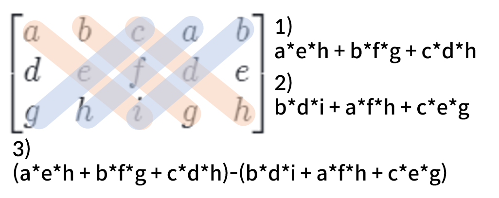
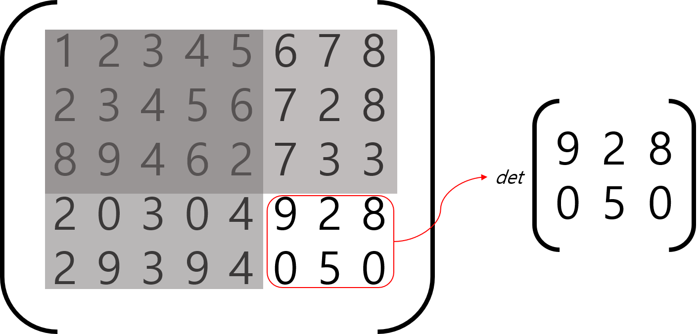
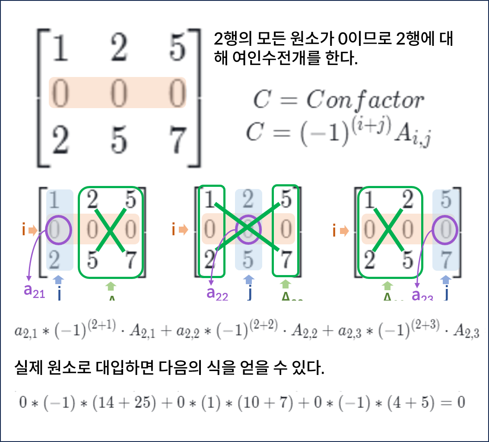

# 4. 행렬 성질

## 대칭행렬 (Symetric Matrix)

대칭 행렬은 자신의 전치 행렬이 원래의 자기 자신과 같은 행렬이다.
즉, $$A^T = A$$ 인 행렬을 의미한다.

대칭행렬을 이루기 위해선 원소의 row index와 column index가 반대로 바뀌어도 동일한 원소를 가져야 한다. $$a_{ij} == a_{ji}$$ 라는 것이다.

대칭 행렬을 이루기 위한 또 다른 조건은 **정방 행렬**이어야 한다는 것이다. 즉, 행렬의 행 크기가 열 크기가 동일해야 한다.

여기서, $$ i==j$$ 인 원소들을 **대각성분(diagonal entry)** 이라고 한다. 대칭행렬은 대각성분을 기준으로 대칭을 이룬다.

---

## 단위행렬(unit matrix, 또는 항등행렬(identity matrix))

대각성분이 모두 1이고, 나머지 요소돌은 모두 0인 대칭 행렬을 의미한다. 대칭행렬이므로 정방행렬이다.

단위 행렬과 벡터의 곱은 벡터에 스칼라 1을 곱하는 것과 같다. 즉, 곱셈 연산 전후로 벡터 값에 변화가 없다.

단위행렬은 $$I_n$$으로 나타낸다. n은 행(열)의 개수를 의미한다. 벡터에 단위 연산을 곱하는 연산을 수식으로 나타내면 다음과 같다

$$
Iw = w
$$

[앞선 챕터에서 다뤘던 행렬곱](../undefined/linear-algebra-basic-chap-3.md#section)에서는 좌항의 행렬을 계수로, 우항의 벡터를 변수로 이해하였다.

이러한 관점에 따라 단위 행렬과 벡터의 곱을 이해하면 다음 그림과 같다.

이러한 단위 행렬의 성질은 역행렬과 직교행렬의 특성을 설명할 때 다시 언급된다.

---

## 대각행렬(diagonal matrix)

대각행렬은 대각 성분을 제외한 원소들이 모두 0이라는 점에서는 동일하나, 대각성분이 1이 아닌 값도 될 수 있다. 즉, 단위 행렬은 대각 행렬의 일종이라고도 이해할 수 있다. 

대각성분벡터(주대각선)로 대각행렬을 표기하는 방법은 다음과 같다. 이때 $$v$$는 주대각선을 이루는 대각성분벡터이다.

$$
D = diag(v)
$$

대각행렬의 대각성분을 이루는 벡터($$diag(v)$$)와 벡터의 곱셈연산은 아마다르곱($$\odot$$)과 같다.

$$
diag(v)X = v\odot X
$$

---

## 역행렬(Inverse Matrix)

역행렬은 같은 꼴의 정방행렬 $$A$$와 단위행렬 $$I$$ 에 대해 $$AX = XA = I$$를 만족시키는 행렬을 의미한다. 일반적으로 행렬곱은 교환법칙이 성립하지 않아 곱셉 순서를 바꾸면 그 결과가 달라지나, 역행렬의 경우 곱셈의 순서를 바꾸어도 그 결과가 단위행렬로 항상 동일하다.

역행렬은 정방행렬이어야 하며, 어떠한 정방행렬에 있어 역행렬은 오직 하나만 존재한다. 

모든 정방행렬이 역행렬을 가지는 것은 아니며, 이러한 행렬을 **특이행렬(Singular Matrix)** 이라고 칭한다. 역행렬을 갖는 행렬은 가역행렬(Non Singular Matrix)이라고 부르기도 한다.

역행렬에 대한 표기는 $$A^{-1}$$로 한다. 분수의 표기와 동일하다. 단위행렬과 행렬의 곱이 스칼라 1을 행렬에 곱한 결과와 비슷하다는 점에서 분수가 연상되기도 한다. 

역행렬을 본격적으로 이해해보기 전에, 헹렬식에 대해 알아보자.

### 행렬식 (determinant)

행렬식이란, 정방행렬에 하나의 수를 대응시키는 함수를 의미한다. 행렬을 통해 연립일차방정식의 해(크래머 공식)를 구하기 위해 고안되었다고 한다. 그 외에도 고윳값을 계산할 떄도 등장하는 용어다. 역행렬에서 행렬식에 대해 다루는 이유는, 행렬식을 통해 역행렬의 존재성을 판별하기 때문이다.

이차정사각행렬에서 기하학적으로 행렬식을 이해하면, 평면상에서 행렬의 열벡터를 표현했을때, 각각의 종점을 연장하여 평행사변형을 만들었을 때의 넓이가 행렬식의 값과 같다.

삼차정사각행렬에서의 행렬식의 값도 마찬가지로, 3차원 공간상에 표현된 평행육면체의 부피와 같다.
2X2 정방행렬에서의 행렬식은 다음과 같다

$$
det
\begin{bmatrix} 
   a & b  \\
   c & d  \\
\end{bmatrix} 
=ad-bc
$$

2X2 정방행렬에서의 행렬식 연산은 간단하다. 대각선을 이루는 원소들끼리 곱하고, 이들을 더하기만 하면 된다.

3X3 정방행렬에서의 행렬식 연산은 좀 복잡하다. 두 가지 방법으로 구해볼 수 있다.

전개 방식

행렬에서 마지막 열을 제외한 나머지 열을 마지막 열의 다음에 붙여준다

이 상태에서 다음 연산을 진행해준다.  

그 다음엔 반대로 구한다.

마지막으로 앞서 구한 두 값을 뺀다.

### 여인수와 소행렬

앞서 짧게 소개한 전개 방식은 사실 여인수분해를 통한 계산을 간단히 한 것이다.

소행렬을 통한 계산을 위해선 소행렬과 여인수분해의 개념을 먼저 숙지해야 한다.

**소행렬 (minor determinant)**

소행렬이란, 특정 열과 행을 제거하고 만든 부분행렬에 대한 행렬식을 의미한다.

행렬에 제외되는 행, 열을 아래첨자로 표기하면 된다. 또는 소행렬에 절댓값 기호를 취해서 나타내는 방법도 있다.

위 식은 i행, j열의 원소들을 제하고 남은 부분에 대한 행렬식을 의미한다. 그림으로 나타내면 다음과 같다.

**여인수(cofactor)와 여인수전개**

여인수전개는 여인수로 행렬식을 구하는 방법을 의미한다. 라플라스 전개라고 부르기도 한다. 

여인수는 소행렬에 (-1)^(i+j)를 곱한 값을 의미한다. 여인수 전개에서는 어떠한 행, 열에 대해 여인수 전개를 진행해도 동일한 값이 도출된다. 따라서, 한 행이나 열이 모두 동일한 값이거나 0이 많이 포함된 경우, 이 행/열에 대해 여인수 전개를 진행하면 매우 효율적으로 계산을 진행할 수 있다.

여인수전개는 4x4, 5x5 등 모든 차원의 정방행렬에 대해 적용될 수 있다.

다음은  3X3 행렬에서 여인수전개로 행렬식 값을 구한 과정을 나타낸 그림이다.

### 행렬식과 역행렬

행렬식을 알아본 이유는, 행렬식을 통해 정방행렬에 역행렬이 존재하는지를 확인할 수 있기 때문이다.

**역행렬이 존재하기 위해선, 행렬식의 값이 0이 아니어야 한다.**
즉, $$det(A) \not 0$$이 역행렬의 성립조건이다. 앞서 언급했듯이, 행렬식의 값은 벡터의 종점을 벡터의 크기만큼 연장시킨 평행사변형의 넓이이다. 행렬값이 0이라는 것은 다시 말하면, 두 벡터가 한 직선 상에 놓인 것이나 마찬가지이다.

역행렬을 구하는 수식은 다음과 같다.

$$
A^{-1}= det(A)
\begin{bmatrix} 
   C_{11} & C_{12} & ... & C_{1n}  \\
   C_{21} & C_{22} & ... & C_{2n} \\
   ..&..&..\\
   C_{12} & ... & C_{1n} \\
\end{bmatrix} 
$$

---

## 직교형렬 (Orthogonal Matrix)

직교 행렬은 정방행렬이면서 행벡터, 열벡터가 모두 수직이어야 한다. 또한, 열벡터, 행벡터의 크기가 1이어야 한다.

즉, 직교행렬은 행렬의 열이 정규직교벡터(Orthogonal Vector)로 이뤄진 행렬을 의미한다.

또한, 직교행렬의 전치행렬과 직교 행렬의 곱은 단위행렬이다. 즉, $$Q^TQ = I$$ 이다. $$Q^TQ = I$$이므로 **역행렬이 곧 전치행렬** 이기도 하다. 즉, $$Q^T = Q^{-1}$$ 이다.

직교행렬과 벡터의 곱의 크기는 벡터의 크기와 같다. 이는 아래의 식으로 증명 할 수 있다.

$$
||Qv|| = ||v||
$$
$$
||Qv|| = (Qv)^TQV
$$
$$
v^TQ^TQv = v^TIv
$$
$$
v^Tv = ||v||
$$

직교행렬과 직교행렬의 곱은 직교행렬이다. 이는 직교행렬이 각도와 길이, 내적을 보존하는 행렬이기 때문이다.

---

## Ref

[[선형대수학] Determinant / 행렬식](https://m.blog.naver.com/lagrange0115/222087882248)

[행렬의 성분, 두 행렬이 서로 같을 조건](https://mathbang.net/558#gsc.tab=0)

[행렬식 이 영상만 보면 기본 끝! | 행렬식의 성질 | 기본행연산과 행렬식](https://www.youtube.com/watch?v=fuVMiyahzH4)

[orthogonal matrix(직교행렬) 과 matrix of orthonormal columns](https://velog.io/@skkumin/orthogonal-matrix%EC%A7%81%EA%B5%90%ED%96%89%EB%A0%AC-%EA%B3%BC-matrix-of-orthonormal-columns)
