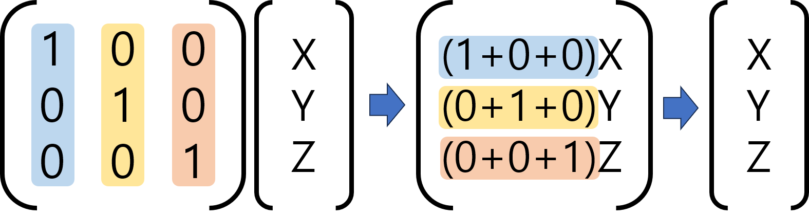

# 4. 행렬 성질

## 대칭행렬 (Symetric Matrix)

대칭 행렬은 자신의 전치 행렬이 원래의 자기 자신과 같은 행렬이다.
즉, $$A^T = A$$ 인 행렬을 의미한다.

대칭행렬을 이루기 위해선 원소의 row index와 column index가 반대로 바뀌어도 동일한 원소를 가져야 한다. $$a_{ij} == a_{ji}$$ 라는 것이다.

대칭 행렬을 이루기 위한 또 다른 조건은 **정방 행렬**이어야 한다는 것이다. 즉, 행렬의 행 크기가 열 크기가 동일해야 한다.

여기서, $$ i==j$$ 인 원소들을 **대각성분(diagonal entry)** 이라고 한다. 대칭행렬은 대각성분을 기준으로 대칭을 이룬다.

## 단위행렬(unit matrix, 또는 항등행렬(identity matrix))

대각성분이 모두 1이고, 나머지 요소돌은 모두 0인 대칭 행렬을 의미한다. 

단위 행렬과 벡터의 곱은 벡터에 스칼라 1을 곱하는 것과 같다. 즉, 곱셈 연산 전후로 벡터 값에 변화가 없다.

단위행렬은 $$I_n$$으로 나타낸다. n은 행(열)의 개수를 의미한다. 벡터에 단위 연산을 곱하는 연산을 수식으로 나타내면 다음과 같다

$$
Iw = w
$$

[앞선 챕터에서 다뤘던 행렬곱](../undefined/linear-algebra-basic-chap-3.md#벡터의 사영과 내적)에서는 좌항의 행렬을 계수로, 우항의 벡터를 변수로 이해하였다.

이러한 관점에 따라 단위 행렬과 벡터의 곱을 이해하면 다음 그림과 같다.

## 대각행렬

## 역행렬

## 직교형렬