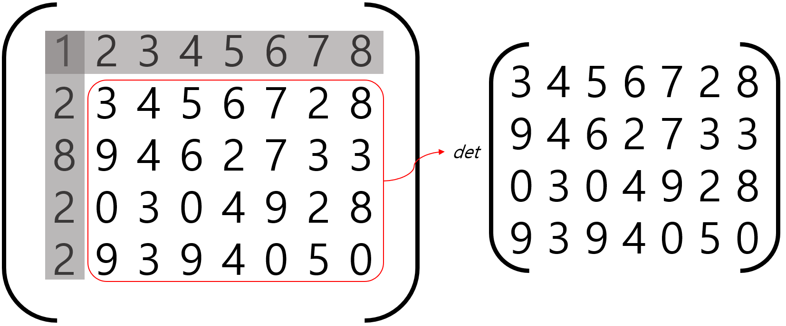

# 4. 행렬 성질

## 대칭행렬 (Symetric Matrix)

대칭 행렬은 자신의 전치 행렬이 원래의 자기 자신과 같은 행렬이다.
즉, $$A^T = A$$ 인 행렬을 의미한다.

대칭행렬을 이루기 위해선 원소의 row index와 column index가 반대로 바뀌어도 동일한 원소를 가져야 한다. $$a_{ij} == a_{ji}$$ 라는 것이다.

대칭 행렬을 이루기 위한 또 다른 조건은 **정방 행렬**이어야 한다는 것이다. 즉, 행렬의 행 크기가 열 크기가 동일해야 한다.

여기서, $$ i==j$$ 인 원소들을 **대각성분(diagonal entry)** 이라고 한다. 대칭행렬은 대각성분을 기준으로 대칭을 이룬다.

## 단위행렬(unit matrix, 또는 항등행렬(identity matrix))

대각성분이 모두 1이고, 나머지 요소돌은 모두 0인 대칭 행렬을 의미한다. 대칭행렬이므로 정방행렬이다.

단위 행렬과 벡터의 곱은 벡터에 스칼라 1을 곱하는 것과 같다. 즉, 곱셈 연산 전후로 벡터 값에 변화가 없다.

단위행렬은 $$I_n$$으로 나타낸다. n은 행(열)의 개수를 의미한다. 벡터에 단위 연산을 곱하는 연산을 수식으로 나타내면 다음과 같다

$$
Iw = w
$$

[앞선 챕터에서 다뤘던 행렬곱](../undefined/linear-algebra-basic-chap-3.md#section)에서는 좌항의 행렬을 계수로, 우항의 벡터를 변수로 이해하였다.

이러한 관점에 따라 단위 행렬과 벡터의 곱을 이해하면 다음 그림과 같다.

이러한 단위 행렬의 성질은 역행렬과 직교행렬의 특성을 설명할 때 다시 언급된다.

## 대각행렬(diagonal matrix)

대각행렬은 대각 성분을 제외한 원소들이 모두 0이라는 점에서는 동일하나, 대각성분이 1이 아닌 값도 될 수 있다. 즉, 단위 행렬은 대각 행렬의 일종이라고도 이해할 수 있다. 

대각성분벡터(주대각선)로 대각행렬을 표기하는 방법은 다음과 같다. 이때 $$v$$는 주대각선을 이루는 대각성분벡터이다.

$$
D = diag(v)
$$

대각행렬의 대각성분을 이루는 벡터($$diag(v)$$)와 벡터의 곱셈연산은 아마다르곱($$\odot$$)과 같다.

$$
diag(v)X = v\odot X
$$

## 역행렬(Inverse Matrix)

역행렬은 같은 꼴의 정방행렬 $$A$$와 단위행렬 $$I$$ 에 대해 $$AX = XA = I$$를 만족시키는 행렬을 의미한다. 일반적으로 행렬곱은 교환법칙이 성립하지 않아 곱셉 순서를 바꾸면 그 결과가 달라지나, 역행렬의 경우 곱셈의 순서를 바꾸어도 그 결과가 단위행렬로 항상 동일하다.

역행렬은 정방행렬이어야 하며, 어떠한 정방행렬에 있어 역행렬은 오직 하나만 존재한다. 

모든 정방행렬이 역행렬을 가지는 것은 아니며, 이러한 행렬을 **특이행렬(Singular Matrix)**이라고 칭한다. 역행렬을 갖는 행렬은 가역행렬이라고 부르기도 한다.

역행렬에 대한 표기는 $$A^{-1}$$로 한다. 분수의 표기와 동일하다. 단위행렬과 행렬의 곱이 스칼라 1을 행렬에 곱한 결과와 비슷하다는 점에서 분수가 연상되기도 한다. 

역행렬을 본격적으로 이해해보기 전에, 헹렬식과 소행렬, 여인수행렬에 대해 잠시 알아보도록 하자

### 행렬식 (determinant)

### 소행렬 (minor determinant)

소행렬이란, 특정 열과 행을 제거하고 만든 부분행렬에 대한 행렬식을 의미한다.

$$
M_{ij}
$$

위 식은 i행, j열까지의 모든 원소들을 제하고 남은 부분에 대한 행렬식을 의미한다. 그림으로 나타내면 다음과 같다.

### 여인수행렬

역행렬의 중요 성질은 다음과 같다.

**1. $$A^{-1}$$이 존재한다면, $$(A^{-1})^{-1}$$은 $$A$$이다. **

## 직교형렬